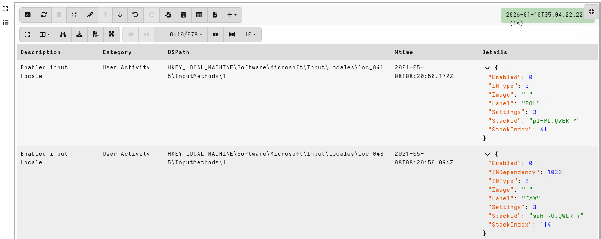

# Developing new rules

This page shows how to develop new rules to the Registry Hunter. I
will work through an example in which I add a new rule.

## Example: Keyboard locales

This artifact was described by `Guzzy (blog.guzzy.dk) | SagaLabs` in
[Hunting Keyboard locales with
Velociraptor)(https://blog.guzzy.dk/posts/hunting_keyboard_velociraptor/)
with an initial
[PR](https://github.com/Velocidex/velociraptor-docs/pull/1165/changes)

### Setting up a development environment

To develop registry rules I will need a Windows VM. I also prefer to
use a development VM (I chose Linux) to actually build the artifact.

#### On the Linux Development system

1. On my Linux Development system I check out the [Registry Hunter Github repo](https://github.com/Velocidex/registry_hunter).

2. I set up a shared directory mounted on `/shared/`

3. Create a directory in the shared folder `/shared/artifacts_definitions/`

4. Within the repository, build the artifact and copy it into the shared folder:

```
$ make build artifact && cp output/Windows.Registry.Hunter.yaml /shared/artifacts_definitions/
go build -o reghunter ./bin/
./reghunter compile --output output/Windows.Registry.Hunter.yaml --meta output/Windows.Registry.Hunter.Meta.yaml Rules/*.yaml
Loading 2 rules from Rules/AppCompatCache.yaml
Loading 2 rules from Rules/Detections.yaml
Loading 586 rules from Rules/RECmdBatch.yaml
Loading 25 rules from Rules/RegRipper.yaml
Loading 60 rules from Rules/Velociraptor-Rules.yaml
```

Now I can rebuild the artifact frequent including my new Rule and the
new artifact will appear in the shared directory.

#### On the Windows Test VM

1. I start an [Instant
Velociraptor](https://docs.velociraptor.app/docs/deployment/#instant-velociraptor)
instance. This brings a local Velociraptor server I can use to run
notebooks on Windows.

2. Next I create a shared directory between the test VM and my
   development environment. I will map this directory as the `F:`
   drive.

3. I create a new notebook and add a new VQL cell with the following query:

```sql
LET ColumnTypes<=dict(`Details`='json/1')

LET _ <= SELECT artifact_set(definition=read_file(filename=OSPath)).name AS Name
FROM glob(globs="F:/artifacts_definitions/*Hunter*yaml")

SELECT *
FROM Artifact.Windows.Registry.Hunter(CollectionPolicy="HashOnly",
                                      RuleFilter="Locale")
WHERE _Source =~ "Results"
```

1. The first query declares the `Details` column as a JSON object with
   the first level open - this is used by the GUI to present it in a
   more readable way.

2. Next I search the shared directory for the Registry Hunter
   artifact, read the data an use `artifact_set()` to import the
   artifact into Velociraptor.

3. Finally I call the new artifact with the RuleFilter only selecting
   the one rule I am currently working on.


### Writing the actual rule

Reading the above blog post describes the system input locales are
configured under the key
`HKEY_LOCAL_MACHINE\SOFTWARE\Microsoft\Input\Locales` This is
[depicted in the blog post](https://blog.guzzy.dk/images/locales.png):


I will add the rule to the `Velociraptor-Rules.yaml` ruleset. Starting
off with the description of the rule, author etc.

```yaml
- Description: Enabled input Locale
  Author: Guzzy (blog.guzzy.dk) | SagaLabs
  Comment: Useful for RDP session attribution.
  Category: User Activity
```

The key I am interested in is under the `HKLM\Software` hive and can be found using the following glob expression

```yaml
  Root: HKEY_LOCAL_MACHINE\Software
  Glob: Microsoft\Input\Locales\loc_*\InputMethods\*
  Filter: x=>x.IsDir
```

I am only interested in Registry Keys under the `InputMethods` key so
I filter by directories (In the Velociraptor abstraction, a registry
key appears as a directory)

Under each key I will show all the values in the `Details` column. The
`Details` column consists of a VQL lambda function which is evaluated
on each key found by the above `Glob`. This allows us to enrich the
`Details` column in an arbitrary way, cross correlate with other keys
etc. Basically anything can be done by the VQL function here.

There are some pre-defined VQL functions that make it easy to do
common things. In this case I will use the `FetchKeyValues()` function
that just fetches all the values under the key as a dictionary.

```yaml
  Details:
    x=>FetchKeyValues(OSPath=x.OSPath)
```




The system has many locales installed, but only a few are enabled. We
are typically not interested in the locales which are not enabled, so
we can modify the Filter to exclude those registry keys that have a
value `Enabled = 1`

```yaml
  Filter: x=>x.IsDir AND GetValue(OSPath=x.OSPath + "Enabled")
```


### User Specific

In the article it is also mentioned that user-specific user keyboard
layouts are also stored as a registry key found in `HKEY_USERS\<User
SID>\Control Panel\International\User Profile`.

We will search the user's hive for these keys and present the name of
the locale with the user's Sid:

```yaml
- Description: Enabled input Locale
  Author: Guzzy (blog.guzzy.dk) | SagaLabs
  Comment: Useful for RDP session attribution.
  Category: User Activity
  Root: HKEY_USERS
  Glob: '*\Control Panel\International\User Profile\*'
  Filter: x=>x.IsDir
  Details:
    x=>dict(Locale=x.OSPath.Basename, UserSid=x.OSPath[-5])
```
